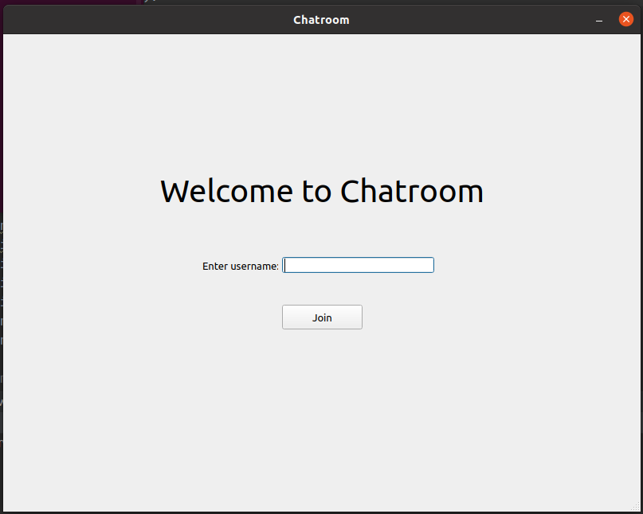
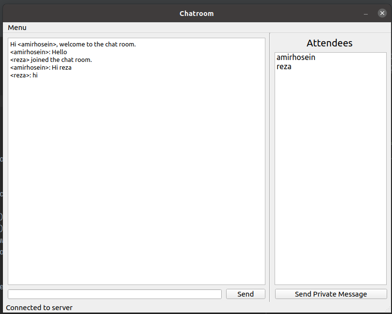
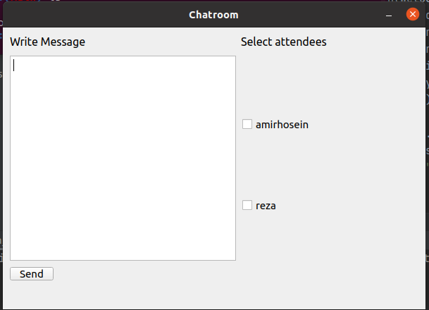

# Chatroom
Network Course Project

Simple Chatroom based on Client/Server Architecture

You can send private and public message

## Running
1. install requirements from `requirements.txt`
2. run `main.py` in `./Server`
3. run `main_GUI.py` in `./Client`

## Protocol

* Client to Server Messages :
  * `Public Message` :

    ```bash
    Public message, length=<message_len>:\r\n
    <message_body>
    ```

  * `Private Message` :

    ```bash
    Private message, length=<message_len> to <user_name1>,<user_name2>,<user_name3>:\r\n
    <message_body>
    ```

  * `Login Request` :

    ```bash
    Hello <user_name>
    ```

  * `Logout Request` :

    ```bash
    Bye.
    ```

  * `Requesting List of Users` :

    ```bash
    Please send the list of attendees.
    ```

* Server to Client Messages:

  * `Public Message` :

    ```bash
    Public message, length=<message_len> from <user_name1>:\r\n
    <message_body>
    ```

  * `Private Message` :

    ```bash
    Private message, length=<message_len> from <user_name1> to <user_name2>,<user_name3>:\r\n
    <message_body>
    ```

  * `User logout` :

    ```bash
    <user_name> left the chat room.
    ```

  * `Welcome Message` :

    ```bash
    Hi <user_name>, welcome to the chat room.
    ```

  * `User Join Public Message` :

    ```bash
    <user_name> joined the chat room.
    ```

## Screenshots
### Welcome

### Public Chat

### Private Message

